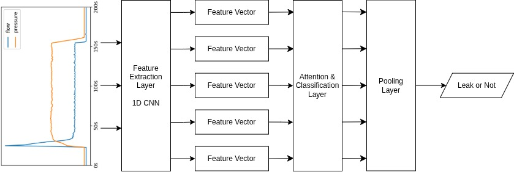

# LeakNet

**Real-Time Leak Detection Using Multiple Instance Learning**

LeakNet is a machine learning model designed for **real-time detection of leaks** in irrigation systems, leveraging a **multiple instance learning (MIL)** approach.

---

## Architecture

**Description:**

1. **Data Acquisition**: Pressure and flow sensors stream data via ESP32 microcontrollers to a server.
2. **Feature Extractor**: Feature vectors are extracted from sensor readings with a 1D CNN layer.
3. **Attention & Classification**: A classification layer predicts which feature vectors contain leaks, while the attention layer assigns each feature vector an attention score. 
4. **Pooling Layer**: The final model prediction is calculated by multiplying the prediction for each feature vector with its respective attention score, and then aggregating all final predictions with the logavgexp function to get a prediction for the whole sequence.

The LeakNet architecture is based on the arXiv paper ["Inherently Interpretable Time Series Classification via Multiple Instance Learning"](https://arxiv.org/abs/2311.10049), with some minor modifications.

---

## Model Details

- **Framework**: PyTorch, PyTorch Lightning  
- **Input**: Sequence of sensor readings  
- **Output**: Probability that the sequence has a leak  
- **Training**: Multiple instance learning - only bag-level labels are provided  
- **Challenges**: Limited labeled data

---

This repository contains only the **model implementation**. For the full system (IoT devices and website), see:

- [ESP32 sensor module](https://github.com/nikas-belogolov/esp32-leak-sensors)
- [Web monitoring interface](https://github.com/nikas-belogolov/leak-detection-system)
